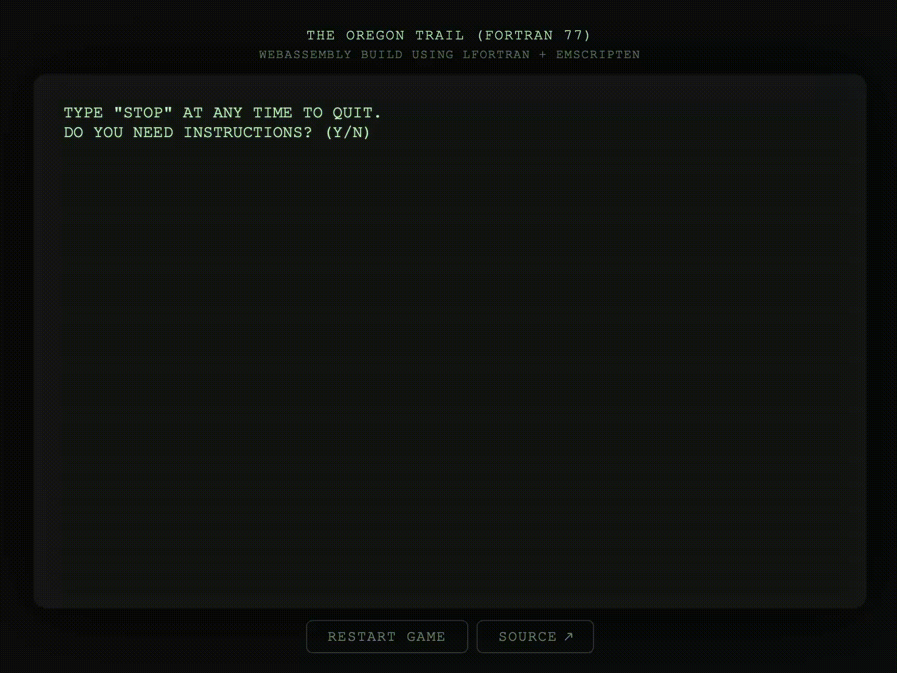

# The Oregon Trail (WebAssembly Build)

[](https://github.com/minhqdao/oregon-fortran-wasm/actions/workflows/ci.yml)
[](https://minhqdao.github.io/oregon-fortran-wasm/)
[](LICENSE)

[](https://minhqdao.github.io/oregon-fortran-wasm/)

The Oregon Trail is a text-based educational game originally developed in 1971 by Don Rawitsch, Bill Heinemann, and Paul Dillenberger in HP Time-Shared BASIC. A revised version was published in the May/June 1978 issue of _Creative Computing_ magazine.

This project is based on **OREGON 77**, an ANSI FORTRAN 77 port of the 1978 version created by Philipp Engel and published in 2022 under the ISC license.

The goal is to explore Fortran-to-WebAssembly compilation using modern Fortran compilers such as LFortran and LLVM Flang. The game is currently built with LFortran and Emscripten and runs entirely in the browser.

## Native Build

Tested with `gfortran`, `lfortran`, and `flang`.

```bash
# gfortran
gfortran src/oregon.f src/oregon_time.f -o oregon

# lfortran
lfortran --fixed-form --implicit-interface --implicit-typing src/oregon.f src/oregon_time.f -o oregon

# flang
flang src/oregon.f src/oregon_time.f -o oregon
```

Run the game with `./oregon`.

## WebAssembly Build

Prebuilt `web/oregon.js` and `web/oregon.wasm` are committed, so no toolchain is needed to run the web version. CI rebuilds them for each deployment.

To rebuild them locally, install [LFortran](https://lfortran.org/) and [Emscripten](https://emscripten.org/), make sure both are on your `PATH`, and run:

```bash
npm run build:wasm
```

> Tested with LFortran 0.67.0 from conda-forge. If you encounter build issues, try using this version.

To run locally:

```bash
npm run dev
```

Then open http://localhost:8080.


## Deployment

Every push to `main` is checked and deployed to GitHub Pages automatically via GitHub Actions.

## Checks

Run the regression suite, browser smoke tests, and typecheck with:

```bash
npm run verify
```


## License

This repository makes no copyright claim on the existing game or source code. All original additions made for this project are licensed under the [ISC License](LICENSE).
